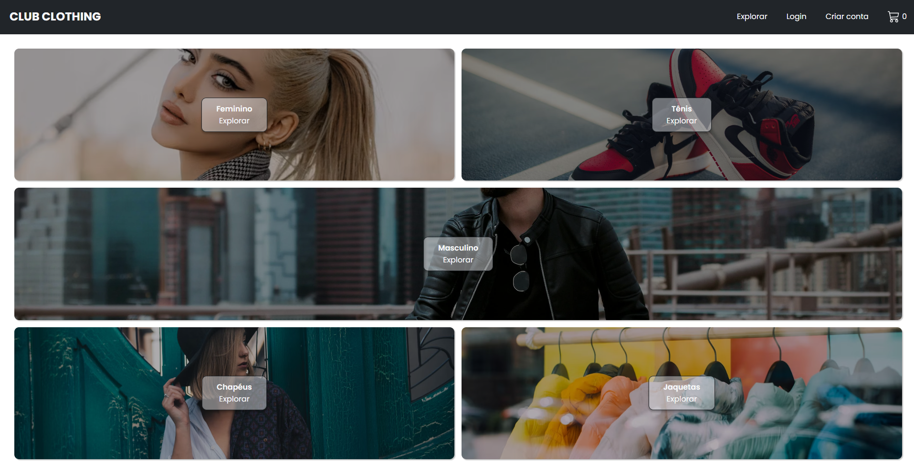

# Ecommerce Club

Projeto front-end para uma plataforma de e-commerce moderna e intuitiva, com integração de login e armazenamento de dados.

## Funcionalidades

- **Login com Google e Email:** Utilizando o Firebase para autenticação.
- **Armazenamento de Imagens:** As imagens dos produtos são armazenadas no Firebase.
- **Carrinho de Compras:** Adicione itens e finalize a compra.
- **Integração com Stripe:** Realize pagamentos de forma segura.
- **Design Responsivo:** Compatível com dispositivos móveis e desktop.
- **Busca de Produtos:** Pesquise facilmente por itens.

## Tecnologias Utilizadas

- ReactJS
- TailwindCSS e SASS
- Firebase (Autenticação e Armazenamento de Imagens)
- Stripe (Pagamentos)

## Você pode acessar o projeto em [Ecommerce Club](https://club-ecommerce-frontend-jet.vercel.app/).
